# Schilk's KiCad Devices
Various KiCad Footprints and Symbols for various Projects

Philipp Schilk, 2020-2021

https://github.com/TheSchilk/KiCad_Devices

# Warning

I make no guarantees about the devices in this repository. Please do your own due diligence. 

# List of Devices:


|**Device**|&nbsp;&nbsp;&nbsp;&nbsp;&nbsp;&nbsp;&nbsp;&nbsp;&nbsp;&nbsp;&nbsp;&nbsp;&nbsp;&nbsp;&nbsp;**Symbol**&nbsp;&nbsp;&nbsp;&nbsp;&nbsp;&nbsp;&nbsp;&nbsp;&nbsp;&nbsp;&nbsp;&nbsp;&nbsp;&nbsp;&nbsp;|&nbsp;&nbsp;&nbsp;&nbsp;&nbsp;&nbsp;&nbsp;&nbsp;&nbsp;&nbsp;&nbsp;&nbsp;&nbsp;&nbsp;&nbsp;**Footprint**&nbsp;&nbsp;&nbsp;&nbsp;&nbsp;&nbsp;&nbsp;&nbsp;&nbsp;&nbsp;&nbsp;&nbsp;&nbsp;&nbsp;&nbsp;|
|---|---|---|
| **74HC161** <br/> 4Bit Sync Counter with par. load and async clear  |  <br/> 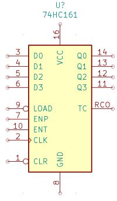 |  |
| **74LVC1G157** <br/> 2in 1out Mux |  <br/> 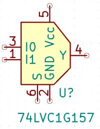 |  |
| **AD8223** <br/> Single-Supply, Low Cost Instrumentation Amplifier |  <br/> 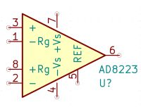 |  |
| **ALPS_SPUN191400 Switch** <br/>  | Use Default KiCad "Switch:SW_DPDT_x2" |  <br/> 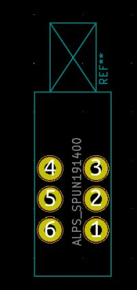  |
| **AP3012** <br/> Simple Boost Converter IC |  <br/> 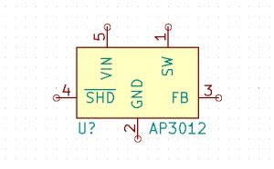 |  |
| **ARM SWD** <br/>  1.27mm 2x5 Serial wire Debug Connector used by many ARM MCUs. Footprint allows for both SMD and TH jack. Includes footprint with and without solder paste  |  <br/> 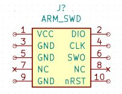 |  <br/> 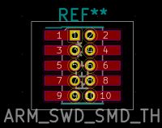  |
| **ATF16V8C CPLD** <br/>  |  <br/> 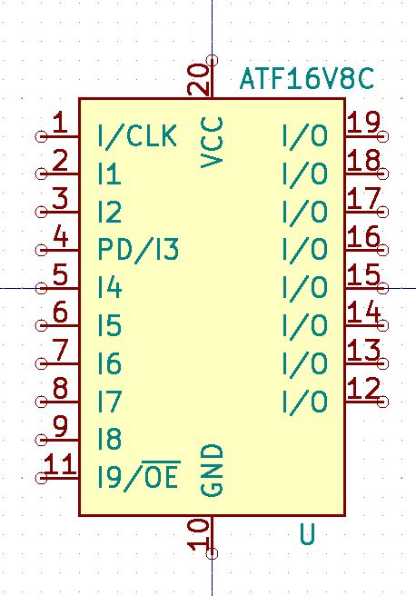 |  |
| **BarrelPolarity 3mm** <br/> A smaller barrel jack polarity indicator |  <br/>  |  <br/> 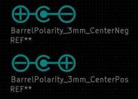  |
| **Bourns 3362P** <br/> Small TH Trimmer pot |  |  <br/> 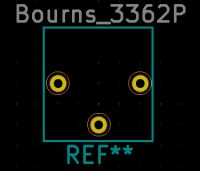  |
| **DIN5_MIDI** <br/> A TH, Right-angle MIDI Jack. | Use DIN-5 |  <br/> 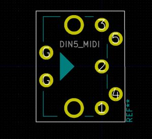  |
| **DPDT_4mm_2.5mm_TH** <br/> **STATUS:** Untested  |  |  <br/> 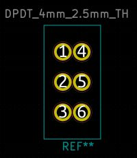  |
| **DPDT_5.6mm_2.5mm_SMD** <br/> **STATUS:** Untested |  |  <br/> 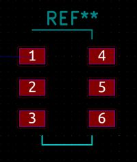  |
| **Finder 40.62** <br/> Dual throw relay |  <br/> 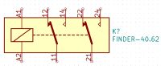 |  |
| **IS62C256AL** <br/>  |  <br/>  |  <br/>   |
| **Jack 3.5mm PJ-313D-6A** <br/> **STATUS:** Untested | Use Connector:AudioJack3 |  <br/> 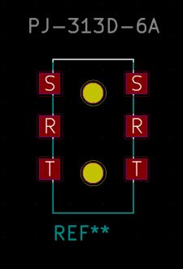  |
| **Jack 3.5mm Switchcraft 35RASMT4BHNTRX** <br/> **STATUS:** Untested, Maybe Borked?! | Use Connector:AudioJack3_SwitchTR |  <br/> 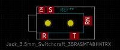  |
| **KobiCon_161-4220-E Dual RCA** <br/> Stereo RCA Jack | Use "RCA_Stereo" from this repo |  <br/>   |
| **LDK320 LDK220** <br/> Very small footprint voltage regulators. |  <br/> 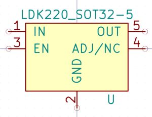 | Symbols kompatible with SOT32-5 and SOT323-5 pinouts. |
| **Leader SMS405** <br/> SMD Shield |  |  <br/> 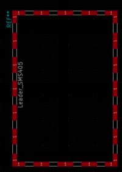  |
| **LM4910** <br/> Stereo Headphone Amp |  <br/> 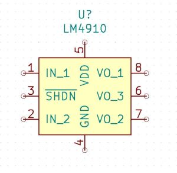 |  |
| **LMV7235** <br/> High-speed, low-voltage, comparator |  <br/> 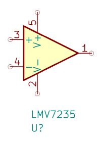 |  |
| **MAX7601** <br/> Voltage Reference |  <br/> 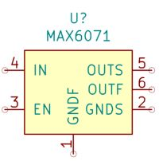 |  |
| **MIC5270** <br/> Very small footprint negative linearvoltage regulators. |  <br/> 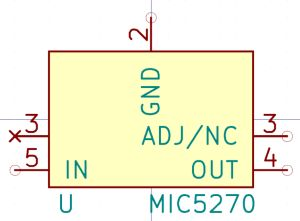 |  |
| **NoRef Footprints** <br/> Standard footprints with no silkscreen reference. |  | Including 0603 R/C/LED 4xRN, 0402 R/LED <br/> 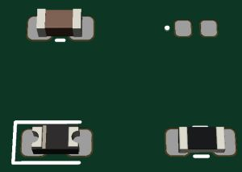  |
| **OMRON G6K-2F-Y Relay** <br/> **Untested**  |  <br/>  <br/>  |  <br/> 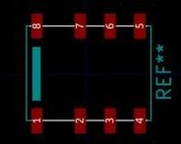  |
| **OPA145DBV** <br/>  |  <br/> 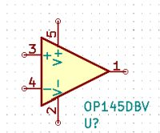 |  |
| **Panasonic TQ2SA Relay** <br/>  |  <br/> 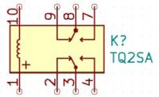 <br/> 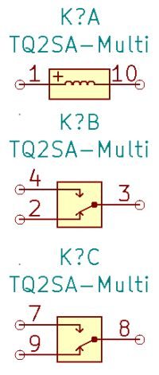 |  <br/>   |
| **PIC12F1571 PIC12F1572** <br/>  |  <br/> 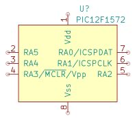 |  |
| **PLCC-32_11.4x14.0mm_P1.27mm_SMD-Socket** <br/>  |  |  <br/> 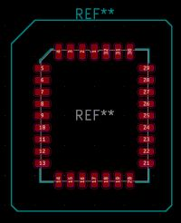  |
| **Q_NMOS_SSSGD** <br/> NMOS with SSSGD Pinout. (i.e. BUK9Y38-100) |  <br/> 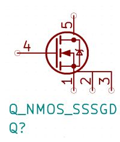 |  |
| **RCA_Stereo** <br/> Generic Stereo RCA Connector |  <br/> 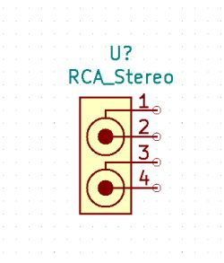 |  |
| **RGB_LED_1.6x1.6x0.6** <br/>  |  |  <br/>   |
| **SN74LVC4245A** <br/> BiDirectional, Tristate-able, LevelShifting Octal Buffer |  <br/> 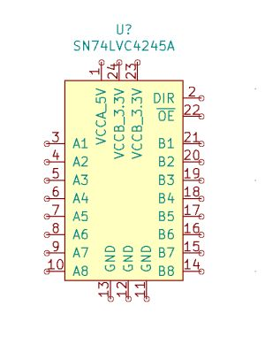 |  |
| **SN76489** <br/>  Programmable Tone Generators, Programmable White Noise Generator |  <br/> 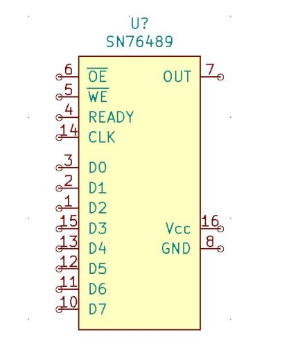 |  |
| **SOT763-1_DHVQFN16** <br/> **STATUS:** Untested |  |  <br/> 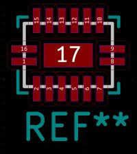  |
| **SOT764-1_DHVQFN20** <br/> **STATUS:** Untested |  |  <br/> 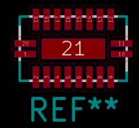  |
| **SSD1309_24PinInterface** <br/> Symbol for Connector for OLEDs with SSD1309 IC that expose 24 pins. |  <br/> 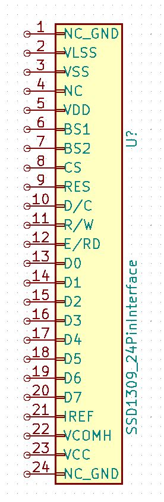 |  |
| **SST39SF0x0_TSOP** <br/> SST39SF0x0 Memories with TSOP-32 Pinout. |  <br/> 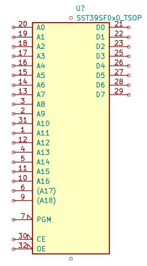 |  |
| **TPS63700** <br/> -15V to -2V inverting DC/DC Converter |  <br/> 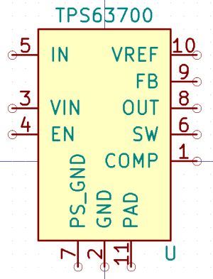 |  |
| **TRS_6.35mm_PCB** <br/> **STATUS:** Untested. | Use AudioJack3_Switch Or no/less switches |  <br/> 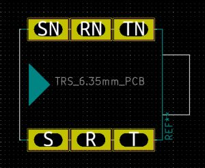  |
| **Vishay_WSL3637** <br/> Large, Kelvin-Connection Current Sensing Resistor. Note that there is a different footprint for smaller resistances. | Use R_Shunt. |  <br/> 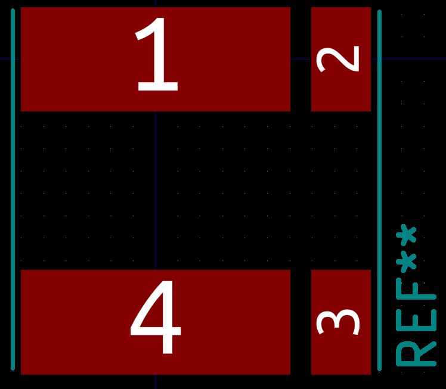  |
| **VOM1271** <br/> Optocoupler with photodiode output |  <br/> 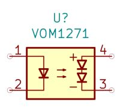 |  |
| **XSD-C4649_TO220_Heatsink** <br/> Small, cheap, TO220 Heatsink | Use Heatsink or Heatsink_Pad |  <br/> 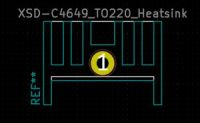  |
| **YM2612** <br/> Vintage 6 Ch, 4 Operator FM Synth IC |  <br/> 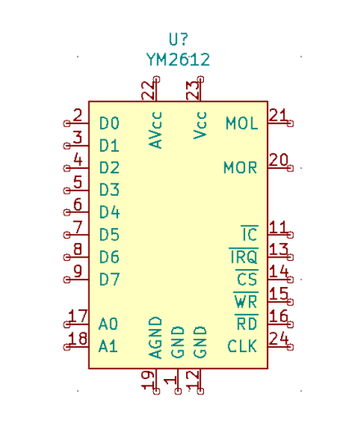 |  |

# Python Readme Manager:
This file is managed using a python script (_Library_Manager/LibraryManager.py)

Each Device features a Device.json file, which is parsed by this script
to extract all relevant information for this file.

To re-generate this README, run:

```bash
> make
```

In the root of this repository.
